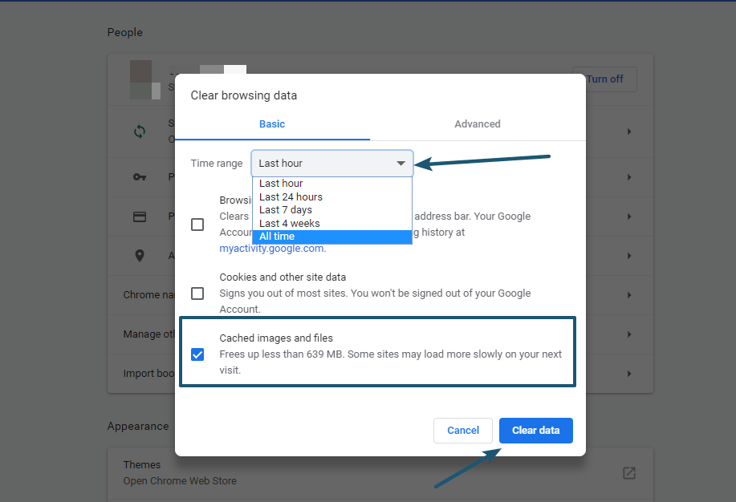
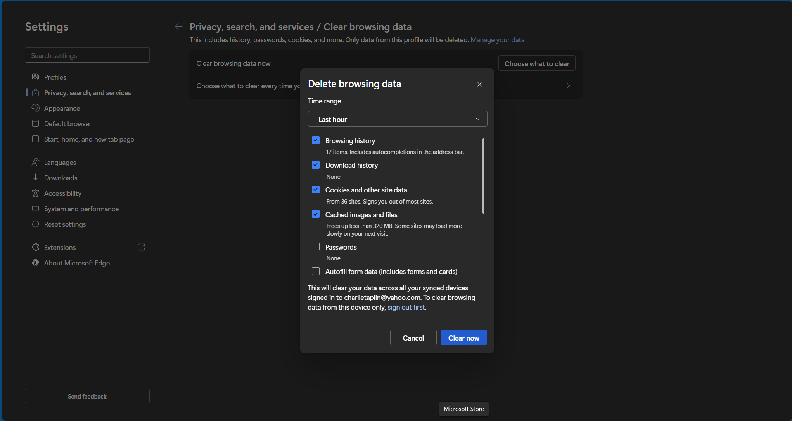
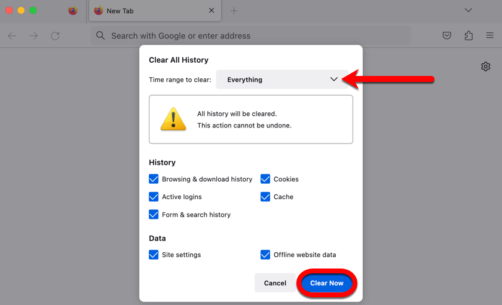

# Clear Browser Cache

This guide shows end users how to clear the cache and cookies in common browsers to resolve loading issues and stale content.

---

## Prerequisites

- Windows 10 or 11 PC  
- A modern browser (Chrome, Edge, or Firefox)  

---

## 1. Google Chrome

1. Click the three-dot menu ⋮ in the top-right corner  
2. Select **More tools** → **Clear browsing data**  
3. In the dialog:
   - Time range: **All time**
   - Check **Cookies and other site data** and **Cached images and files**
4. Click **Clear data**  
5. Restart Chrome  

---

## 2. Microsoft Edge

1. Click the three-dot menu ⋮ in the top-right corner  
2. Choose **Settings**  
3. Navigate to **Privacy, search, and services**  
4. Under **Clear browsing data**, click **Choose what to clear**  
5. Time range: **All time**  
6. Check **Cookies and other site data** and **Cached images and files**  
7. Click **Clear now**  
8. Restart Edge  

---

## 3. Mozilla Firefox

1. Click the hamburger menu ☰ in the top-right corner  
2. Select **Settings**  
3. Go to **Privacy & Security**  
4. Scroll to **Cookies and Site Data** → click **Clear Data…**  
5. Check **Cookies and Site Data** and **Cached Web Content**  
6. Click **Clear**  
7. Restart Firefox  

---

## Tips & Common Pitfalls

- Clearing cache logs you out of most sites—have passwords ready.  
- If issues persist, consider disabling extensions or testing in Incognito/Private mode.  
- On managed devices, group policies may restrict cache clearing; contact IT if buttons are greyed out.  

---

