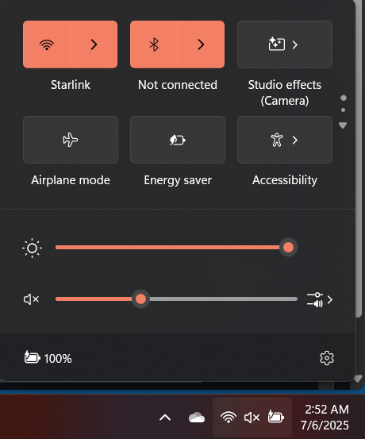
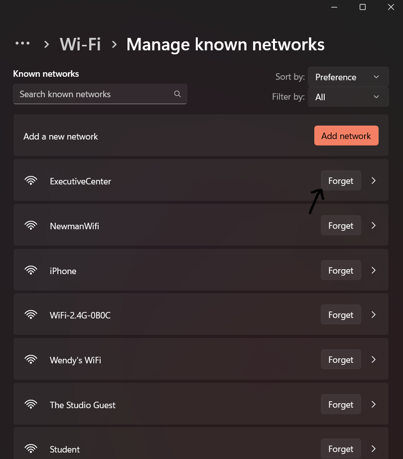

# Wi-Fi Connectivity Guide

A step-by-step guide to help end users troubleshoot and restore Wi-Fi connections on Windows 10/11.

---

## Prerequisites

- Windows 10 or 11 PC with a functional Wi-Fi adapter  
- SSID (network name) and wireless password  
- Administrative rights to reset adapters  

---

## 1. Ensure Wi-Fi Is Turned On

1. Click the **Network** icon in the system tray (near the clock).  
2. Verify **Wi-Fi** is toggled **On**.  
3. If it’s off, click the Wi-Fi tile to enable it.  



---

## 2. Check Adapter Status in Settings

1. Press **Win + I** to open **Settings**.  
2. Go to **Network & Internet → Wi-Fi**.  
3. Click **Hardware properties** and confirm the adapter shows **Enabled**.  


---

## 3. Forget & Reconnect to the Network

1. In **Network & Internet → Wi-Fi**, click **Manage known networks**.  
2. Select your SSID → click **Forget**.  
3. On the Wi-Fi list, select your SSID and enter the password when prompted.  



---

## 4. Restart the Wi-Fi Adapter

Open an elevated PowerShell (Admin):

```powershell
Disable-NetAdapter -Name "Wi-Fi" -Confirm:$false
Enable-NetAdapter  -Name "Wi-Fi" -Confirm:$false
```

Step 4: Restart Adapter

---

## 5. Verify Connectivity
- Open Command Prompt.
- Ping a public IP to test basic reachability:
ping 8.8.8.8 -n 4
- Ping a domain to test DNS resolution:
ping google.com -n 4


Step 5: Test Connectivity

---

## 6. (Optional) Reset Network Stack
If issues persist, run these commands in elevated Command Prompt:
```
netsh winsock reset
netsh int ip reset
ipconfig /release
ipconfig /renew
ipconfig /flushdns
```

Restart your PC after running them.

---

## Tips & Common Pitfalls
- Ensure you’re within range—weak signal can cause drops.
- Move other electronics away; cordless phones and microwaves interfere.
- Update your Wi-Fi driver via Device Manager → Network adapters.
- If corporate Wi-Fi uses certificates, confirm your device has the latest profiles.
- On managed devices, group policies may disable network resets—contact IT if commands fail.

